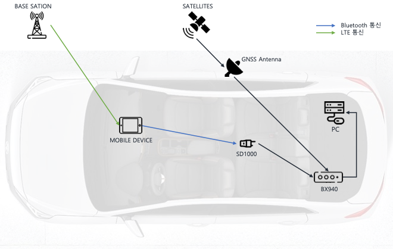

# GNSS

[back to the main README.md](../README.md)

---
## Specification
- Manufacture : Trimble
- Model : BX940 (with GNSS Antenna)
---
## Configuration Setup
Initial setup based on web service
- Access with <http://169.254.1.0>
- ID : admin
- PW : passward
---
## Installation
